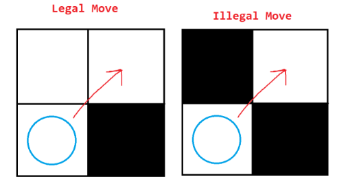
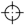
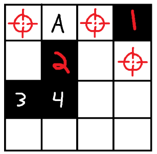

# Tank Game Rules v3

Created by: Bryan Friestad and WDC Longmont

Players: 2 – 100

Time: 3+ days

# Play

Each player controls 1 Tank. At the start of each gameday
each living Tank is given 1 action.
An action can be spent to Move or Shoot. If you do not wish
to Move or Shoot that day, you can save your action for
another day, but you cannot have more than 5 actions at any
time. After taking each action, note the action you took
into the Logbook.

You may take an action(s) at any time during the gameday,
and you can do any combination of actions (in any order), as
long as you have enough saved up. If you have multiple
actions saved up, you do not need to spend all of them in
one turn (that is, you can spend some and save some).

You can only shoot at tanks within your range. Your range
can be increased with Gold, which comes from Gold Mines.
Gold can also be traded for actions (see Spending Gold).

# SETUP

Each player should be given one tank card and assigned a
spawn randomly. Provide a blank Logbook next to the physical
board. All Tanks start with 3 lives and a range of 2. Write
this information, as well as your name, on the tank card.

# ENDING THE GAME

The game ends when there is only 1 Living Tank remaining on
the board. That Tank is the Last Man Standing and the winner
of the game.

# ACTIONS

## Move

Spend an action to move to any adjacent space. You cannot
move into an occupied space. You can move diagonally, but
only if you could otherwise make the move in 2 steps (see
images).

## Shoot

Spend an action to make an attack. You can target any grid
space within your range that you have line of sight on.

* If the grid space is empty, you automatically miss.
* If the grid space is occupied by a wall or dead tank, you automatically hit, and it loses 1 durability.
* If the grid space is occupied by a living tank, you must roll to see if you hit or miss.
    * Determine the distance to the target.
    * Note your tank’s range.
    * Roll a # of dice equal to `(Range – Distance) + 1`.
        * Shortcuts:
        * When at your range, roll 1 die.
        * When adjacent, roll [range] dice.
    * If any of the dice show this symbol , your attack hits, and the tank loses 1 life.

# GOLD

Gold is a secondary resource that is used for a few things.
You collect it by being positioned in the Gold Mine at the
start of a day, or by taking it from other tanks when you
kill them. Gold may also be transferred between tanks, but
there is a Tax on this. There is no limit to the amount of
gold you can hold.

## Spending Gold

Gold can be spent to increase your tank’s range or traded
for actions. The more gold you trade, the more efficient the
conversion to actions. See the following table:

Gold Cost | What you get
----------|--------------
8 gold    | +1 Range
3 gold    | +1 Action
5 gold    | +2 Actions
10 gold   | +4 Actions

## Transferring Gold

Gold can be given to other tanks within your range. You do
not need to have line of sight to share gold. The Tax on
transferring gold is 1 gold per instance. For example, if
you want to give 5 gold to another Tank, it will cost you 6
gold. There are no limits to the number of times you can
transfer gold per gameday, given that you have the gold. The
1 gold Tax is put into the Coffer (see The Council below).

## Looting Gold

When you kill or destroy another Tank, you gain whatever
gold they had, even if it was nothing.

## Gold Mine

There is an area(s) on the game board marked as the Gold
Mine. At the start of each gameday, each Gold Mine generates
an amount of gold equal to the number of grid spaces it
overlaps with on the board. The gold is divided up among all
living Tanks that are within that area. If the Gold does not
divide up evenly, the remainder is put into the Coffer. If
there are no tanks in the mine, all of the gold it generates
is put into the Coffer.

When a wall which is <ins>orthogonally adjacent</ins> to an existing
Gold Mine is broken, the Gold Mine expands into that space,
and the amount of gold it generates increases accordingly.
If at any time, two or more independent Gold Mines are
orthogonally adjacent, then all involved mines are merged.

# DEATH AND DESTRUCTION

## Death

When a Tank is killed, it stays where it is on the board. It
loses its actions and gold, and it gains 3 Durability. Dead
tanks do not gain actions at the start of the day, nor can
they perform actions. Dead tanks do not gain gold from gold
mines, nor can they spend gold in any way. Dead tanks retain
their range.

If you kill a tank, you gain all of the gold that tank had.
Note this kill in the Logbook (see above).

## Destruction

When a tank is destroyed, it is removed from the board. If
you destroy a tank, you gain nothing.

## Resurrection

If a dead tank gains a life for any reason, it becomes a
living tank. It regains its ability to gain and perform
actions. It regains its ability to gain gold from mines and
spend gold. You have no action tokens until you gain one for
some reason, such as the Council or the start of a gameday.

# THE COUNCIL

“The Council” is a group of out-of-play players that can
still affect the outcome of the game. If your tank is dead,
you are considered a Councilor, and your vote counts as 1
vote. If your Tank is destroyed, then you are a Senator, and
your vote counts as 2 votes.

The Council has a Coffer of gold which accumulates
throughout the game (see Gold and Gold Mine above). The
Coffer exists even if nobody is on the council. At any time
during a gameday, the Council may vote on one of the
following Decrees. If the vote passes, the gold is spent. If
the Coffer doesn’t have the required gold, you can’t do it.

Decree     | Vote Type            | Cost     | Target                  | Effect
-----------|----------------------|----------|-------------------------|--------------------------------------
Stimulus   | Uncontested Majority | 3 gold   | Living Tank             | Target gains 1 action
Bounty     | Uncontested Majority | 1–5 gold | Living Tank             | There is a bounty on the target Tank
Grant Life | Unanimous            | 15 gold  | Any Tank Living or Dead | Target gains a life

## More Information/Limitations

* Stimulus - There is no limit to the number of decrees per gameday.
* Bounty - The council must agree on both the target of and the amount of the bounty. The bounty does not go away until that tank is dead. The player who kills the tank gets all of the bounty gold. If the target tank already has a bounty, then their bounty increases by the amount of the new bounty (it accumulates). Only one bounty may be decreed each gameday.
* Grant Life – The Council may only choose this decree once it has at least 3 members. No tank may have more than 3 lives. May only be decreed once per gameday.

Votes from councilors may be sent in virtually, but the final result must be recorded in the Logbook.

# LOGBOOK

The Logbook is the source of truth for the game. All
activity must be written into the Logbook, or else it is not
considered to have happened. Activity is applied in the
order it is written in the Logbook. All activity must be
written by the person performing that activity. Any
illegal/invalid activity written into the logbook will be
struck out and undone. You will not get any spent actions or
gold back.

## Examples:

### Move

* “10/9/2023 – Schmude – Move to B3”

### Shoot

* “10/10/2023 – Corey – Shoot at G4 (hit)”
* “10/11/2023 – Xavion – Shoot at D7 (miss)”

### Giving Gold

* “10/19/2023 – Bryan – Give 5 Gold to Schmude”

### Upgrade

* “10/19/2023 – Ryan – Upgrade Range”

### Trade Gold

* “10/20/2023 – Stomp – Trade 5 gold”

### Council Decrees

* “10/20/2023 – Council Decree – Stimulus to Stomp”
* “10/21/2023 – Council Decree – 3 Gold Bounty on Xavion”
* “10/22/2023 - Council Decree – Grant Life to Ty”

### Kills

* “10/23/2023 – Craig killed”

# DEFINITIONS

## Activity

Any use of action (move or shoot), use of gold (transferred or spent),
or decree passed by the Council is “Activity”

## Adjacent

The 8 grid spaces surrounding grid space X are considered Adjacent to X.

## Dead / Killed

A Tank is Dead if it has 0 lives. The Tank which hit it, bringing it
from 1 life to 0 lives is the Tank that killed it.

## Destroyed

A Tank or Wall is Destroyed if it has 0 durability. The Tank which hit
it, bringing it from 1 durability to 0 durability is the Tank that
destroyed it. When something is destroyed, it is removed from the game
permanently.

## Distance

The distance from one tank/wall to another tank/wall is defined by the
distance between their grid spaces. The distance from one grid space
to another is the minimum number of adjacent steps it takes to go from
one to another.

Expressed algebraically: `min(abs(a.x-b.x), abs(a.y-b.y))`

## Durability

The number of hits something can take until it’s Destroyed.

## Gameday

A Gameday is defined as follows: Any Monday, Wednesday or Thursday
that the office is open, from 8am to 6pm.

## Hit

A hit is the result of a successful shoot action.

## Line Of sight

Given an attacker A and a target B, line of sight is defined as
follows. A has line of sight on B, if you can draw a straight,
uninterrupted line from the center of A’s
space to the center of B’s space. Walls and
Tanks that are not your target count as
interruptions to lines. Crossing the corner of
something is also considered an interruption.
Consider the diagram to the right. Attacker
‘A’ has a range of 2. They can hit tanks in
all red-marked squares. ‘A’ can also hit walls
1 & 2, but NOT walls 3 & 4.

## Living

A Tank is Living if it has at least 1 life.

## Miss

A miss is the result of an unsuccessful shoot action.

## Occupied

A space is occupied if there is a wall or tank (living or dead) in it.

## Orthogonally Adjacent

The 4 grid spaces to the top, bottom, left and right of grid space X
are considered Orthogonally Adjacent to X.

## Out-Of-Play

A player whose tank is dead or destroyed.

## Range

Given Tank A and a range of R, A can attack/give with any other Tank
that is within R spaces from A’s position.

## Uncontested Majority

An uncontested majority is a vote where one and only one option has at
least 50% of the votes. Ties (ex. 2 votes for Tank A and 2 votes for
Tank B) fail to pass.

# Patch notes

* Firing and Hit Chance
    * Hit chance is now dependent on your range and distance from the target
    * Each hit die has 3 hits and 3 misses
    * Action rate and cost is reverted to v1 rules
        * 1 action per day
        * 1 to move
        * 1 to shoot
        * Max of 5
* Spending Gold
    * You can no longer share actions or lives
    * You can now share gold, but there is a tax
    * You always gain however much gold a tank had when you kill them
    * Range upgrades can only be bought with gold
    * Higher amounts of gold can be traded for more actions
* Gold Mine
    * The gold mine now expands in size when you break walls that are orthogonally adjacent to it
    * The amount of the gold the mine generates each day is 1 gold per grid space
* The Council
    * All actions from earlier versions are gone
    * Replaced with “Stimulus”, “Bounty”, and “Grant Life” decrees
    * Stimulus gives a living tank an extra action for 3 gold
    * Bounty gives money to whomever kills a particular tank
    * Grant life costs 15 gold, but gives a tank a life
    * The council gains gold in its coffer from taxes and leftovers from the gold mine
* Line of sight is blocked by corners of tanks/walls
* Dead Tanks start with 3 durability instead of 5
* Invalid/Illegal activity (actions + gold stuff) are undone, and the actions/gold involved are forfeited